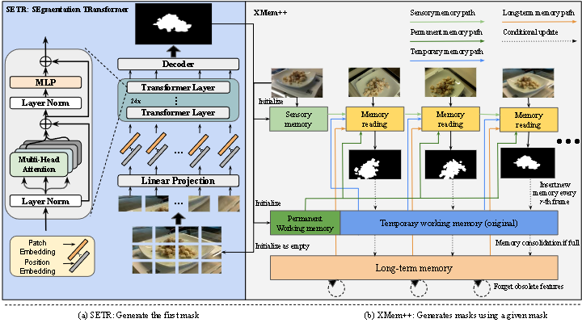
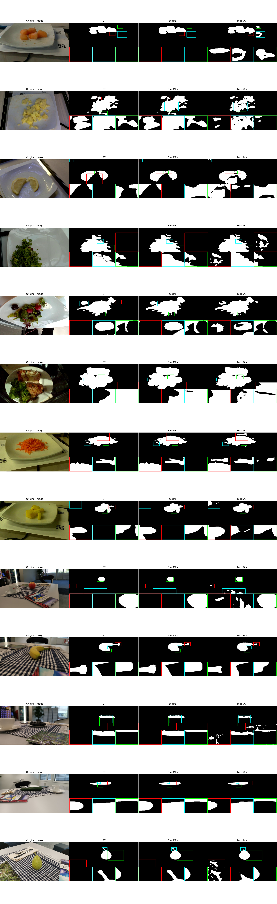
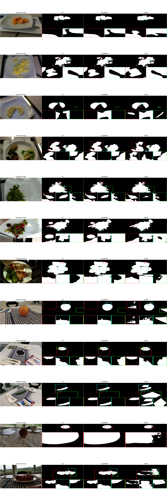
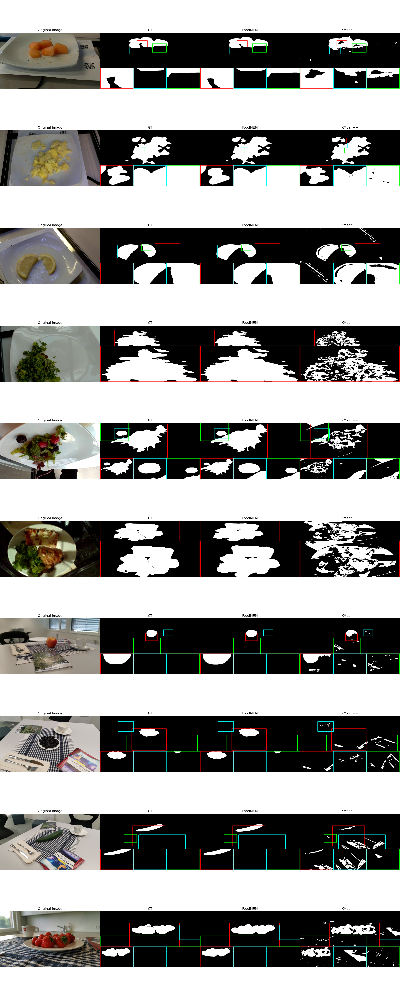

# FoodMEM: A Fast and Precise Food Video Segmentation

---

## Abstract
Food segmentation is crucial in various research fields, such as health, agriculture, and food biotechnology. Segmenting and tracking different types of food in images or videos is undeniably a significant achievement, and it is currently considered a newly emerging topic in today’s society. Our study aims to find and develop a production-grade framework for segmenting and tracking various types of food in a given set of images or videos at high-quality performance and near-real-time speed with minimum hardware resources. This unlocks many challenges in real-world applications, such as food volume estimation, calories estimation, 3D reconstruction, augmented and virtual reality, or digital twins. We introduce FoodMem, a novel framework for segmenting food in 360º scenes. Our framework can effectively segment food portions in a given video and generate accurate masks. Most semantic segmentation models, especially for food-related tasks, have limitations that affect their performance, such as handling different camera locations that did not exist in the training set. Plus, the inference speed for individual images does not fit real-world applications, especially those that focus on video processing. In contrast, memory-based models are becoming popular in object-tracking applications because of their performance and speed. Still, they are limited since they rely on user input, such as the user drawing the input mask manually, which indicates a lack of automation. To overcome these limitations, we propose FoodMem, a novel Food Video segmentation framework that combines the (1) SETR model to generate segment one- or few- masks of the food portions in a given scene and (2) XMem++, a memory-based tracking model, to track the food masks in complex scenes. Our framework performs better than the state-of-the-art food segmentation frameworks in segmenting food in different camera-capturing locations, illumination, reflection, scene complexity, and food diversity, achieving a significant segmentation noise reduction, artifact elimination, and completing the missing parts. We also introduce an annotated food dataset, which covers new challenging use cases not found in previous benchmarks. We conduct extensive experiments on Nutrition5k and Vegetables and Fruits datasets, showing that FoodMem improves the state-of-the-art by 2.5% mean average precision in food video segmentation. Moreover, FoodMem is 58 times faster than the state-of-the-art on average for both datasets.



We used a single image input for simplicity. Our two-stage framework (a) shows the SETR framework, where it accepts an image and generates a mask, followed by (b) XMem2, which accepts the mask and a set of images as a given input and produces masks for all frames.

## Checkpoints
Checkpoint must be added to the root dir (It must look like FoodMEM/ckpts/SETR_MLA/iter_80000.pth): https://drive.google.com/drive/folders/1Bxwj8FDGIdOnEnscjLwB7sisHlMHdo7H?usp=drive_link
Saves must be added to the XMem2 dir (It must look like FoodMEM/XMem2/saves): https://drive.google.com/drive/folders/1pLiy-hyjzscLjmysexPDmp5DW3QJv0t4?usp=drive_link

## Installation
````bash
conda create -n FoodMEM python=3.8

conda activate FoodMEM   

conda install pytorch==1.8.1 torchvision==0.9.1 torchaudio==0.8.1 cudatoolkit=11.3 -c pytorch -c conda-forge

pip install -U openmim

mim install mmcv-full==1.7.1

pip install -r requirements.txt

cd XMem2

pip install -r requirements.txt

bash scripts/download_models.sh

bash scripts/download_models_demo.sh
````

## Getting started
````bash
python XMem2/process_video.py --video <path/to/folder> --masks <path/to/folder> --output <path/to/folder>
````

## Evaluation
````bash
python .\src\eval_map.py --submit_dir <path/to/folder> --truth_dir <path/to/folder> --output <path/to/folder>
````

## Quantitative results

### Average execution times of the different models

| **Dataset**       | **Frames range** | **FoodSAM** | **DEVA** | **kMean++** | **Ours**       |
|-------------------|------------------|-------------|----------|-------------|----------------|
| **Nutrition5k**   | 19-65            | 00:12:34    | 00:00:40 | 00:01:07    | **00:00:25**   |
| **V&F**           | 172-232          | 00:44:20    | 00:02:04 | 00:05:11    | **00:00:31**   |

*The models include FoodSAM, DEVA, kMean++, and our framework. The inference time was recorded in the format of hours:minutes:seconds.*

### Mean Average Precision (mAP)

| **Dataset**       | **FoodSAM** | **DEVA** | **kMean++** | **Ours**       |
|-------------------|-------------|----------|-------------|----------------|
| **Nutrition5k**   | **0.9192**  | 0.8825   | 0.4232      | 0.9098         |
| **V&F**           | 0.8914      | 0.8548   | 0.4361      | **0.9499**     |

*Comparison of mean average precision scores achieved by different models on two datasets: Nutrition5k and V&F. The models evaluated include FoodSAM, DEVA, kMean++, and our framework.*

### Comparison of Recall Scores

| **Dataset**       | **FoodSAM** | **DEVA** | **kMean++** | **Ours**       |
|-------------------|-------------|----------|-------------|----------------|
| **Nutrition5k**   | **0.7752**  | 0.7301   | 0.6467      | 0.7708         |
| **V&F**           | 0.9441      | 0.9328   | 0.9245      | **0.9469**     |

*Comparison of recall scores achieved by different models on two datasets: Nutrition5k and V&F. The models evaluated include FoodSAM, DEVA, kMean++, and our framework.*

NOTE: FoodSAM performs better than our framework in the Nutrition5k dataset. This is because FoodSAM was trained on datasets where the camera followed a predefined path to capture images, similar to the setup in the Nutrition5k dataset. On the other hand, our framework performs better in the Vegetables & Fruits dataset, where the camera has freedom of movement, resulting in less predictable image capture scenarios.

## Qualitative results

### FoodSAM and FoodMem



### DEVA and FoodMem



### KMean++ and FoodMem



## Acknowledgements

A large part of the code is borrowed from the following projects:

1. [FoodSAM](https://github.com/jamesjg/FoodSAM/)
2. [SETR](https://github.com/fudan-zvg/SETR)
3. [XMem++](https://github.com/mbzuai-metaverse/XMem2)

Also mention the following works that helped us to understand and develop our framework:

1. [Vision Transformer (ViT)](https://github.com/google-research/vision_transformer)
2. [Segment Anything](https://github.com/facebookresearch/segment-anything)
3. [DEVA](https://github.com/hkchengrex/Tracking-Anything-with-DEVA)
4. [XMem](https://github.com/hkchengrex/XMem)
5. [Nutrition5k](https://github.com/google-research-datasets/Nutrition5k)
6. [Vegetables & Fruits](https://www.sciencedirect.com/science/article/pii/S2405844023019291)
7. [LabelMe](https://github.com/labelmeai/labelme)
8. [Imagededup](https://github.com/idealo/imagededup)