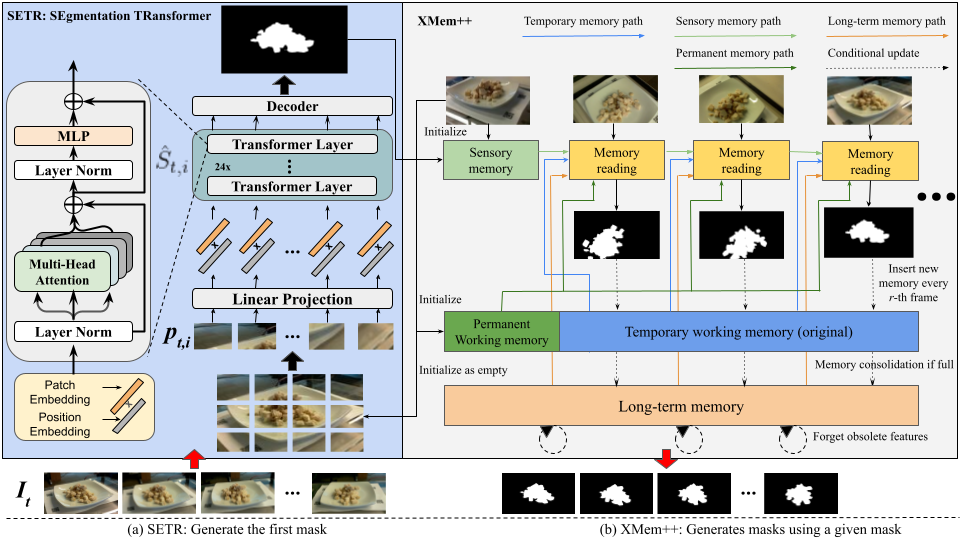

# FoodMem: Near Real-time and Precise Food Video Segmentation

---


We used a single image input for simplicity. Our two-stage framework (a) shows the SETR framework, where it accepts an image and generates a mask, followed by (b) XMem2, which accepts the mask and a set of images as a given input and produces masks for all frames.

## Checkpoints
Checkpoint must be added to the root dir (It must look like FoodMem/ckpts/SETR_MLA/iter_80000.pth): https://drive.google.com/drive/folders/1Bxwj8FDGIdOnEnscjLwB7sisHlMHdo7H?usp=drive_link
Saves must be added to the XMem2 dir (It must look like FoodMem/XMem2/saves): https://drive.google.com/drive/folders/1pLiy-hyjzscLjmysexPDmp5DW3QJv0t4?usp=drive_link

## Installation
````bash
conda create -n FoodMem python=3.8

conda activate FoodMem   

conda install pytorch==1.8.1 torchvision==0.9.1 torchaudio==0.8.1 cudatoolkit=11.3 -c pytorch -c conda-forge

pip install -U openmim

mim install mmcv-full==1.7.1

pip install -r requirements.txt

cd XMem2

pip install -r requirements.txt

bash scripts/download_models.sh

bash scripts/download_models_demo.sh
````
## Or Run with Docker
```bash
# Build the docker image
docker build -t gcvcg/foodmem .

# Run in Docker
docker run --gpus all -it --rm -e DISPLAY=:1 \ 
-v /tmp/.X11-unix:/tmp/.X11-unix \
-v /path/to/data:/vgdata \
-v $(pwd)/workspace:/app/workspace gcvcg/foodmem bash run.sh /vgdata/$SCENEID

# in case you want to run it in parallel.
# ls -d /vgdata/*/* | parallel -I% --max-args 1  --jobs 1 bash run.sh %
```

## Getting started
````bash
python XMem2/process_video.py --video <path/to/folder> --masks <path/to/folder> --output <path/to/folder>
````

## Evaluation
````bash
python .\src\eval_map.py --submit_dir <path/to/folder> --truth_dir <path/to/folder> --output <path/to/folder>
````

## Quantitative results

### Average execution times of the different models

| **Dataset**       | **Frames range** | **FoodSAM** | **DEVA** | **kMean++** | **Ours**       |
|-------------------|------------------|-------------|----------|-------------|----------------|
| **Nutrition5k**   | 19-65            | 00:12:34    | 00:00:40 | 00:01:07    | **00:00:25**   |
| **V&F**           | 172-232          | 00:44:20    | 00:02:04 | 00:05:11    | **00:00:31**   |

*The models include FoodSAM, DEVA, kMean++, and our framework. The inference time was recorded in the format of hours:minutes:seconds.*

### Mean Average Precision (mAP)

| **Dataset**       | **FoodSAM** | **DEVA** | **kMean++** | **Ours**       |
|-------------------|-------------|----------|-------------|----------------|
| **Nutrition5k**   | **0.9192**  | 0.8825   | 0.4232      | 0.9098         |
| **V&F**           | 0.8914      | 0.8548   | 0.4361      | **0.9499**     |

*Comparison of mean average precision scores achieved by different models on two datasets: Nutrition5k and V&F. The models evaluated include FoodSAM, DEVA, kMean++, and our framework.*

### Comparison of Recall Scores

| **Dataset**       | **FoodSAM** | **DEVA** | **kMean++** | **Ours**       |
|-------------------|-------------|----------|-------------|----------------|
| **Nutrition5k**   | **0.7752**  | 0.7301   | 0.6467      | 0.7708         |
| **V&F**           | 0.9441      | 0.9328   | 0.9245      | **0.9469**     |

*Comparison of recall scores achieved by different models on two datasets: Nutrition5k and V&F. The models evaluated include FoodSAM, DEVA, kMean++, and our framework.*

NOTE: FoodSAM performs better than our framework in the Nutrition5k dataset. This is because FoodSAM was trained on datasets where the camera followed a predefined path to capture images, similar to the setup in the Nutrition5k dataset. On the other hand, our framework performs better in the Vegetables & Fruits dataset, where the camera has freedom of movement, resulting in less predictable image capture scenarios.

## Qualitative results

### FoodSAM and FoodMem


### DEVA and FoodMem


### KMean++ and FoodMem


## Acknowledgements

A large part of the code is borrowed from the following projects:

1. [FoodSAM](https://github.com/jamesjg/FoodSAM/)
2. [SETR](https://github.com/fudan-zvg/SETR)
3. [XMem++](https://github.com/mbzuai-metaverse/XMem2)

Also mention the following works that helped us to understand and develop our framework:

1. [Vision Transformer (ViT)](https://github.com/google-research/vision_transformer)
2. [Segment Anything](https://github.com/facebookresearch/segment-anything)
3. [DEVA](https://github.com/hkchengrex/Tracking-Anything-with-DEVA)
4. [XMem](https://github.com/hkchengrex/XMem)
5. [Nutrition5k](https://github.com/google-research-datasets/Nutrition5k)
6. [Vegetables & Fruits](https://www.sciencedirect.com/science/article/pii/S2405844023019291)
7. [LabelMe](https://github.com/labelmeai/labelme)
8. [Imagededup](https://github.com/idealo/imagededup)
